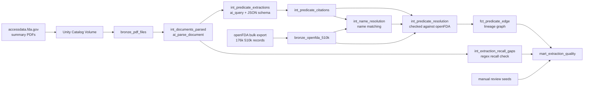
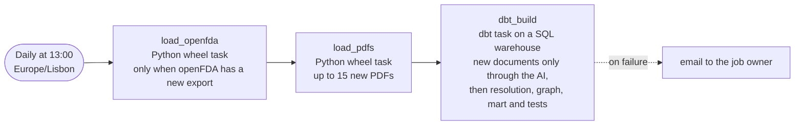
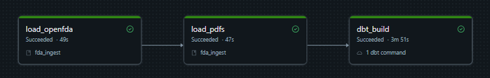
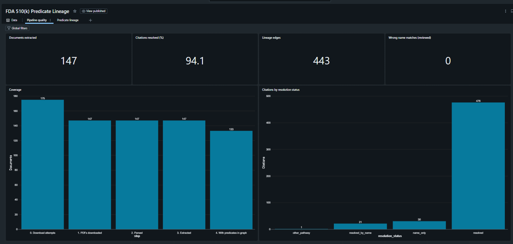
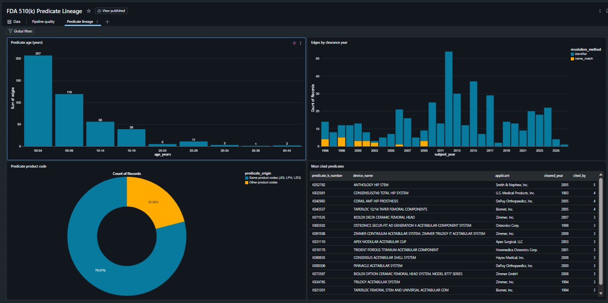

# FDA 510(k) Predicate Lineage

[](https://github.com/doriel/fda-510k-predicate-lineage/actions/workflows/ci.yml)

Extracting predicate device lineage from FDA 510(k) summary PDFs with Databricks AI functions, then validating it against openFDA with dbt.

A 510(k) clearance lets a medical device go to market by showing it is substantially equivalent to a device already on the market: its **predicate**. openFDA publishes the clearances as structured data, but not which predicates each device cited. That information only exists in the summary PDFs, many of them scanned, faxed or partly handwritten. This project turns those documents into a lineage graph (device cites predicate) and measures how far the extracted data can be trusted.

> **Status:** work in progress. The pipeline runs end to end, every day, on a growing sample of hip implant submissions (product codes JDI, LPH and LZO): 15 new PDFs per run. Next steps are listed at the end.

## How it works



1. **Ingestion (Python, Databricks job).** Loads all openFDA 510(k) metadata, then downloads summary PDFs for the sample into a Unity Catalog Volume. Failed downloads are recorded with their status, not dropped.
2. **Parsing (dbt).** `ai_parse_document` turns each PDF into text and tables, including scanned pages.
3. **Extraction (dbt).** `ai_query` with a strict JSON schema extracts predicates, reference devices, identifiers and device names.
4. **Resolution (dbt).** Every extracted identifier is checked against openFDA: does it exist, was it cleared before the device citing it, is it well formed. Each citation gets an explicit status instead of being silently kept or dropped.
5. **Name matching (dbt).** Predicates cited by name only ("PFC Total Hip System, Johnson & Johnson") are matched to openFDA with a deterministic word-similarity score. A match is accepted only when it is clearly ahead of the next candidate; otherwise the citation stays unresolved.
6. **Lineage (dbt).** Resolved predicates become edges in `fct_predicate_edge`, each marked with how it was resolved: `identifier` or `name_match`.
7. **Quality (dbt).** `mart_extraction_quality` collects coverage, resolution and measured quality metrics in one table.

The two AI models are incremental with full refresh disabled, so each document is processed once, and a `dbt run --full-refresh` cannot re-run the LLM on everything by accident.

## Orchestration

One Databricks job, defined in the Asset Bundle ([resources/pipeline_job.yml](resources/pipeline_job.yml)), runs the whole pipeline every day:





- **Incremental by design.** Each task only does new work: openFDA is reloaded when a new export exists, PDFs already attempted are skipped (failures included), and only unprocessed documents reach `ai_parse_document` and `ai_query`. A run with nothing new costs almost nothing.
- **Bounded AI cost.** `max_pdfs` (15) caps downloads per run and `ai_batch_limit` (30) caps documents sent to the AI, so a backlog is absorbed over several days instead of in one expensive run.
- **Tests in every run.** `dbt build` runs the unit test and all data tests. Errors fail the run and trigger the email. New recall gaps or name matches that are not reviewed yet raise warnings, not failures, and show up in the quality mart.
- **Two targets.** `dev` is for testing: resources get a `[dev <user>]` prefix and the schedule is paused. `prod` holds the scheduled job.
- **No secrets.** dbt runs on the SQL warehouse as the job owner, and Databricks generates the dbt profile, so no token is stored anywhere.

## Results on the current sample

All numbers come from `mart_extraction_quality`, snapshot of 3 October 2026 (170 documents). The sample grows every day.

| Step | Result |
|---|---|
| PDFs downloaded | 170 of 205 attempts (each failed attempt is recorded with its status) |
| Parsed with `ai_parse_document` | 170 of 170 |
| Extracted with `ai_query` | 170 of 170 |
| Predicate citations resolved to openFDA | 594 of 635 (94%): 571 by K-number, 23 by name matching |
| Left unresolved | 40 citations named without a number and without a confident match (never guessed), 1 citing another pathway |
| Lineage graph | 540 edges (517 by K-number, 23 by name), 409 distinct predicates |
| Devices with at least one predicate in the graph | 154 of 170 |
| Median predicate age | about 5.7 years between the predicate's clearance and the citing device's |

**Measured quality**, from manual reviews stored as dbt seeds. Every case is reviewed; when the sample grows and a new one appears, dbt warns until it is added to the review.

| Check | Result |
|---|---|
| Recall check: K-numbers in the text that the LLM did not extract | 77 found, 77 reviewed: **1 real miss**. The rest are compatible devices, earlier products of the same family, devices cleared in the same letter, and OCR misreads of the document's own number |
| Name matches | 23 reviewed: **18 correct, 5 plausible, 0 wrong**. Plausible means same company and a closely matching name, but the openFDA record is too generic, or a variant, to confirm the exact product |

The one real miss is K223828: its summary names two devices in the same substantial equivalence sentence, and the model extracted one of them (as a reference) but not the other. It is kept in the review seed, so the metric stays visible instead of being fixed by hand.

During the extraction spike, a 28-page scanned submission (K123598) listing about 100 predicates was extracted with 102 of 102 distinct identifiers matching the PDF, while an independent Tesseract OCR baseline misread 5 of them. Details in [the spike write-up](docs/spikes/2026-09-extraction-spike.md).

These checks measure recall on K-numbers present in the text and precision of name matching. Field-level precision and recall of the extraction as a whole need the hand-labeled evaluation set planned in [ADR 0006](docs/decisions/0006-hand-labeled-evaluation-set.md).

## Dashboard

A Databricks AI/BI dashboard on top of the quality mart and the lineage graph (screenshots from 1 October 2026). Its data is refreshed by the daily job, and the dashboard itself is defined in the Asset Bundle ([resources/fda_dashboard.dashboard.yml](resources/fda_dashboard.dashboard.yml)): the queries use table names only, and the catalog, schema and warehouse come from the environment, like the job.





What the lineage page shows on the current sample:

- Most predicates are recent: about 70% were cleared less than 10 years before the device citing them.
- About 1 in 5 edges points to a device outside the three sampled product codes, so the lineage crosses device categories.
- Edges resolved by name matching come from submissions cleared between 1996 and 2009. Older summaries often name their predicates without a K-number.

## Data quality

65 data tests and 1 unit test, including:

- **Lineage rules** (custom generic tests): every predicate exists in openFDA, was cleared on or before the device citing it, has a valid K-number format, and is not the device itself.
- **Resolution logic** (dbt unit test): one case per status, including the repair of a 7-digit typo printed in a source document (`K9903690` resolved to `K990369` only because that number exists and predates the subject) and a confident versus an ambiguous name match.
- **AI output checks**: no failed `ai_query` calls, no unparsed documents, unique keys per prompt version.
- **Review coverage**: a warning when a new recall gap or name match appears that the manual reviews do not cover yet, so the measured quality cannot silently go out of date.

**CI** ([GitHub Actions](.github/workflows/ci.yml)) runs on every push and pull request: it checks the lock file, runs the Python unit tests and parses the dbt project. It has no access to the Databricks workspace, so models, data tests and the dbt unit test run in the daily job instead.

Findings that shaped these checks, such as documents citing predicates by name only, reference devices listed next to predicates, OCR misreading a document's own number into a real but unrelated device, and typos in the source PDFs, are recorded in the [decision records](docs/decisions/README.md).

## Design decisions

| # | Decision |
|---|---|
| [0001](docs/decisions/0001-ai-models-incremental-no-full-refresh.md) | dbt models that call AI functions are incremental, with full refresh disabled |
| [0002](docs/decisions/0002-parse-in-dbt-on-sql-warehouse.md) | Document parsing runs in dbt on a SQL warehouse |
| [0003](docs/decisions/0003-llm-extraction-regex-as-check.md) | Predicates are extracted by an LLM; regex is only a recall check |
| [0004](docs/decisions/0004-citation-model-and-resolution.md) | Citations carry an identifier type and a resolution status; name-only predicates are matched conservatively |
| [0005](docs/decisions/0005-versioned-extractions.md) | Extractions are versioned by prompt and model, never overwritten |
| [0006](docs/decisions/0006-hand-labeled-evaluation-set.md) | Accuracy is measured against a hand-labeled evaluation set |

The full physical model is in [docs/data-model.md](docs/data-model.md).

## Stack

- **Databricks**: Unity Catalog, Volumes, serverless jobs and SQL warehouse, `ai_parse_document`, `ai_query` (Claude Sonnet 4.5 through Databricks model serving), AI/BI dashboards
- **dbt** (`dbt-databricks`): incremental models, custom generic tests, unit tests, seeds for manual reviews
- **Databricks Asset Bundles** for the daily job (Python wheel tasks and a dbt task) and the dashboard, with `dev` and `prod` targets
- **Python** for ingestion, with pytest unit tests
- **uv** for dependencies (`uv.lock`)
- **GitHub Actions** for CI

## Running it

Prerequisites: a Databricks workspace with Unity Catalog and AI functions, permission to create tables and a Volume in one schema, a SQL warehouse, the Databricks CLI, and [uv](https://docs.astral.sh/uv/).

```bash
# 1. Environment
uv sync --all-groups
source .venv/bin/activate
cp .env.example .env          # fill in your profile, catalog, schema and warehouse
set -a; source .env; set +a

# 2. Test the full pipeline once (dev target, schedule paused)
databricks bundle deploy
databricks bundle run fda_pipeline

# 3. Deploy the scheduled daily job
databricks bundle deploy -t prod
```

For local development, dbt can also run from your machine against the same warehouse (`cd dbt && dbt build`).

No workspace details or secrets are stored in the repository: everything comes from `.env`, which is git-ignored.

## Repository layout

```
databricks.yml          Asset Bundle (workspace comes from the environment)
.github/workflows/      CI
resources/              Databricks job (daily pipeline) and dashboard definitions
src/fda_ingest/         Python ingestion package
src/*.lvdash.json       Dashboard definition (exported from the UI)
tests/                  pytest tests for the ingestion code
dbt/                    dbt project: staging, intermediate and marts models, tests
docs/decisions/         Decision records
docs/spikes/            Extraction spike write-up
docs/images/            Screenshots used in this README (job run, dashboard)
scripts/                Feasibility check and spike SQL
```

## Next steps

- Keep the manual reviews up to date as the sample grows
- Prompt change to catch predicates named in the substantial equivalence sentence (the one real miss)
- Hand-label 20 to 30 documents and report precision and recall per field and era ([ADR 0006](docs/decisions/0006-hand-labeled-evaluation-set.md))
- Capture primary and additional predicates separately (prompt v3)
- Extend the sample beyond three product codes