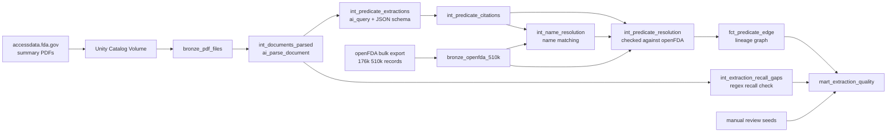

# FDA 510(k) Predicate Lineage

Extracting predicate device lineage from FDA 510(k) summary PDFs with Databricks AI functions, then validating it against openFDA with dbt.

A 510(k) clearance lets a medical device go to market by showing it is substantially equivalent to a device already on the market: its **predicate**. openFDA publishes the clearances as structured data, but not which predicates each device cited. That information only exists in the summary PDFs, many of them scanned, faxed or partly handwritten. This project turns those documents into a lineage graph (device cites predicate) and measures how far the extracted data can be trusted.

> **Status:** work in progress. The pipeline runs end to end on a sample of 100 hip implant submissions (product codes JDI, LPH and LZO). Next steps are listed at the end.

## How it works



1. **Ingestion (Python, Databricks job).** Loads all openFDA 510(k) metadata, then downloads summary PDFs for the sample into a Unity Catalog Volume. Failed downloads are recorded with their status, not dropped.
2. **Parsing (dbt).** `ai_parse_document` turns each PDF into text and tables, including scanned pages.
3. **Extraction (dbt).** `ai_query` with a strict JSON schema extracts predicates, reference devices, identifiers and device names.
4. **Resolution (dbt).** Every extracted identifier is checked against openFDA: does it exist, was it cleared before the device citing it, is it well formed. Each citation gets an explicit status instead of being silently kept or dropped.
5. **Name matching (dbt).** Predicates cited by name only ("PFC Total Hip System, Johnson & Johnson") are matched to openFDA with a deterministic word-similarity score. A match is accepted only when it is clearly ahead of the next candidate; otherwise the citation stays unresolved.
6. **Lineage (dbt).** Resolved predicates become edges in `fct_predicate_edge`, each marked with how it was resolved: `identifier` or `name_match`.
7. **Quality (dbt).** `mart_extraction_quality` collects coverage, resolution and measured quality metrics in one table.

The two AI models are incremental with full refresh disabled, so each document is processed once, and a `dbt run --full-refresh` cannot re-run the LLM on everything by accident.

## Results on the current sample

All numbers come from `mart_extraction_quality`.

| Step | Result |
|---|---|
| PDFs downloaded | 82 of 100 attempts (each failed attempt is recorded with its status) |
| Parsed with `ai_parse_document` | 82 of 82 |
| Extracted with `ai_query` | 82 of 82 |
| Predicate citations resolved to openFDA | 299 of 320 (93%): 284 by K-number, 15 by name matching |
| Left unresolved | 21 citations named without a number and without a confident match, never guessed |
| Lineage graph | 246 edges (231 by K-number, 15 by name), 216 distinct predicates |
| Devices with at least one predicate in the graph | 70 of 82 |
| Median predicate age | about 5 years between the predicate's clearance and the citing device's |

**Measured quality**, from manual reviews stored as dbt seeds:

| Check | Result |
|---|---|
| Recall check: K-numbers in the text that the LLM did not extract | 41 found, 41 reviewed, **0 were real misses** (compatible devices, product history, OCR misreads of the document's own number) |
| Name matches | 15 reviewed: **13 correct, 2 plausible, 0 wrong** |

During the extraction spike, a 28-page scanned submission (K123598) listing about 100 predicates was extracted with 102 of 102 distinct identifiers matching the PDF, while an independent Tesseract OCR baseline misread 5 of them. Details in [the spike write-up](docs/spikes/2026-09-extraction-spike.md).

These checks measure recall on K-numbers present in the text and precision of name matching. Field-level precision and recall of the extraction as a whole need the hand-labeled evaluation set planned in [ADR 0006](docs/decisions/0006-hand-labeled-evaluation-set.md).

## Data quality

65 data tests and 1 unit test, including:

- **Lineage rules** (custom generic tests): every predicate exists in openFDA, was cleared on or before the device citing it, has a valid K-number format, and is not the device itself.
- **Resolution logic** (dbt unit test): one case per status, including the repair of a 7-digit typo printed in a source document (`K9903690` resolved to `K990369` only because that number exists and predates the subject) and a confident versus an ambiguous name match.
- **AI output checks**: no failed `ai_query` calls, no unparsed documents, unique keys per prompt version.
- **Review coverage**: a warning when a new recall gap or name match appears that the manual reviews do not cover yet, so the measured quality cannot silently go out of date.

Findings that shaped these checks, such as documents citing predicates by name only, reference devices listed next to predicates, OCR misreading a document's own number into a real but unrelated device, and typos in the source PDFs, are recorded in the [decision records](docs/decisions/README.md).

## Design decisions

| # | Decision |
|---|---|
| [0001](docs/decisions/0001-ai-models-incremental-no-full-refresh.md) | dbt models that call AI functions are incremental, with full refresh disabled |
| [0002](docs/decisions/0002-parse-in-dbt-on-sql-warehouse.md) | Document parsing runs in dbt on a SQL warehouse |
| [0003](docs/decisions/0003-llm-extraction-regex-as-check.md) | Predicates are extracted by an LLM; regex is only a recall check |
| [0004](docs/decisions/0004-citation-model-and-resolution.md) | Citations carry an identifier type and a resolution status; name-only predicates are matched conservatively |
| [0005](docs/decisions/0005-versioned-extractions.md) | Extractions are versioned by prompt and model, never overwritten |
| [0006](docs/decisions/0006-hand-labeled-evaluation-set.md) | Accuracy is measured against a hand-labeled evaluation set |

The full physical model is in [docs/data-model.md](docs/data-model.md).

## Stack

- **Databricks**: Unity Catalog, Volumes, serverless jobs and SQL warehouse, `ai_parse_document`, `ai_query` (Claude Sonnet 4.5 through Databricks model serving)
- **dbt** (`dbt-databricks`): incremental models, custom generic tests, unit tests, seeds for manual reviews
- **Databricks Asset Bundles** for the ingestion job
- **Python** for ingestion, with pytest unit tests
- **uv** for dependencies (`uv.lock`)

## Running it

Prerequisites: a Databricks workspace with Unity Catalog and AI functions, permission to create tables and a Volume in one schema, the Databricks CLI, and [uv](https://docs.astral.sh/uv/).

```bash
# 1. Environment
uv sync --all-groups
source .venv/bin/activate
cp .env.example .env          # fill in your profile, catalog, schema and warehouse
set -a; source .env; set +a

# 2. Ingestion: openFDA metadata and the PDF sample
databricks bundle deploy
databricks bundle run fda_ingest

# 3. Transformations, AI steps and tests
cd dbt
dbt build
```

No workspace details or secrets are stored in the repository: everything comes from `.env`, which is git-ignored.

## Repository layout

```
databricks.yml          Asset Bundle (workspace comes from the environment)
resources/              Databricks job definitions
src/fda_ingest/         Python ingestion package
tests/                  pytest tests for the ingestion code
dbt/                    dbt project: staging, intermediate and marts models, tests
docs/decisions/         Decision records
docs/spikes/            Extraction spike write-up
scripts/                Feasibility check and spike SQL
```

## Next steps

- A dashboard on the lineage graph and the quality mart
- CI with GitHub Actions (unit tests and dbt parsing; the workspace itself is not reachable from CI)
- Hand-label 20 to 30 documents and report precision and recall per field and era ([ADR 0006](docs/decisions/0006-hand-labeled-evaluation-set.md))
- Capture primary and additional predicates separately (prompt v3)
- Run dbt from the bundle job, so ingestion and transformations run as one workflow
- Extend the sample beyond three product codes